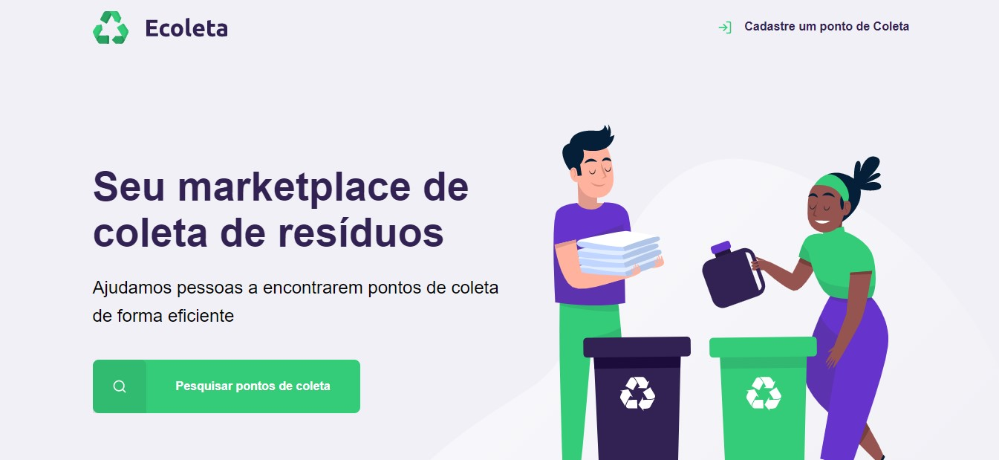
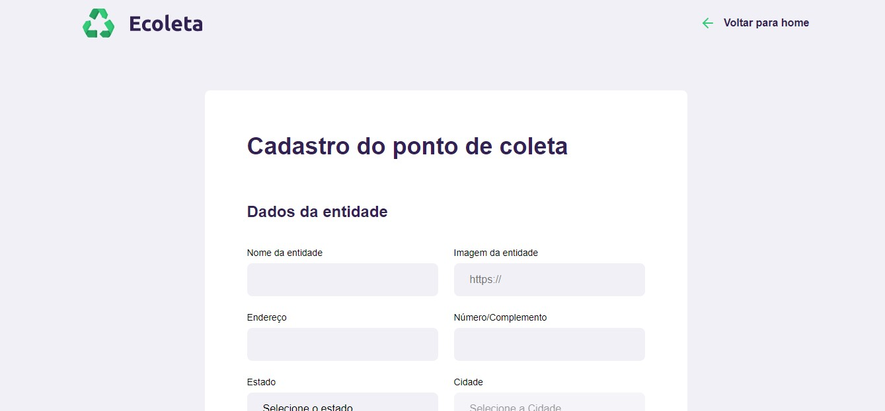
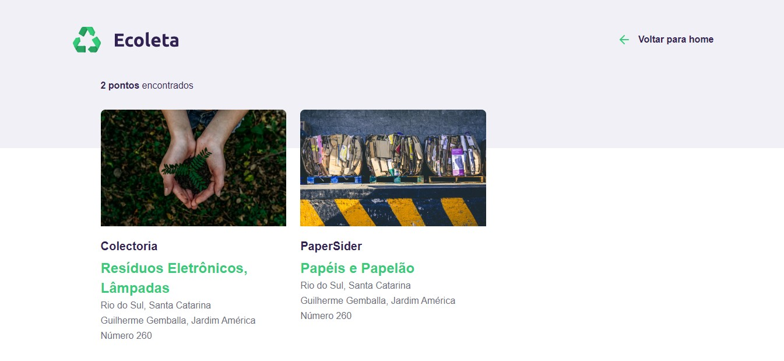

# Ecoleta
## Site com cadastros e consultas de pontos de coleta de resíduos. 
### Aplicação criada utilizando node.js, nunjucks, além de hmtl css e js

Para rodar o site na sua máquina é preciso ter o [node](https://nodejs.org/pt-br/download/) instalado, baixe o projeto e na pasta raiz execute o comando para instalar as dependências:

```
npm install
```

E para executar:

```
npm start
```

Depois é só acessar no navegador 'localhost:3000' e a página estará lá!

As páginas da aplicação são:






